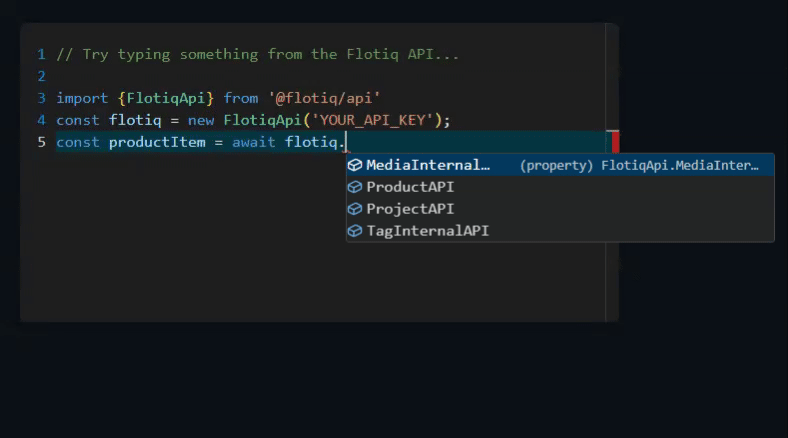

<a href="https://flotiq.com/">
    
</a>


flotiq-codegen-ts
=================

This package generates Typescript Fetch API integration for your Flotiq project.


## See it in action!



Go to this [JSFiddle](https://jsfiddle.net/o5rafnpw/1/) to see a (limited) demo.

## Quickstart

```
npx flotiq-codegen-ts generate
```

## Usage

Run `flotiq-codegen-ts`, provide your API key and wait for your Typescript code to be generated in the `flotiqApi` folder.
Then start using it:

```javascript
import { FlotiqApi } from 'flotiqApi/src';
const FLOTIQ_RO_API_KEY = 'YOUR_API_KEY';
const flotiq = new FlotiqApi(FLOTIQ_RO_API_KEY);
  
// Use your IDE IntelliSense to work with types & api endpoints!

const eventList = await flotiq.EventAPI.list({limit:100});
```

## Usage in JS project
If you wish to use `flotiqApi` in JS project you can use `flotiq-codegen-ts` with `--compiled-js` flag

```
npx flotiq-codegen-ts generate --compiled-js
```

Now set of compiled `d.ts` and `.js` will be automatically generated in your `flotiqApi` folder.
You can now import and use the API in your project:

```javascript
import { FlotiqApi } from 'flotiqApi/index';
const FLOTIQ_RO_API_KEY = 'YOUR_API_KEY';
const flotiq = new FlotiqApi(FLOTIQ_RO_API_KEY);
  
// Use your IDE IntelliSense to work with types & api endpoints!

const eventList = await flotiq.EventAPI.list({limit:100});
```


## Developing

To start developing this project, follow these steps:

1. Clone the repository `git clone git@github.com:flotiq/flotiq-codegen-ts.git` 
2. Install dependencies `yarn install`
3. Run the project `yarn start`

## Collaborating

If you wish to talk with us about this project, feel free to hop on our [](https://discord.gg/FwXcHnX).

If you found a bug, please report it in [issues](https://github.com/flotiq/flotiq-codegen-ts).
